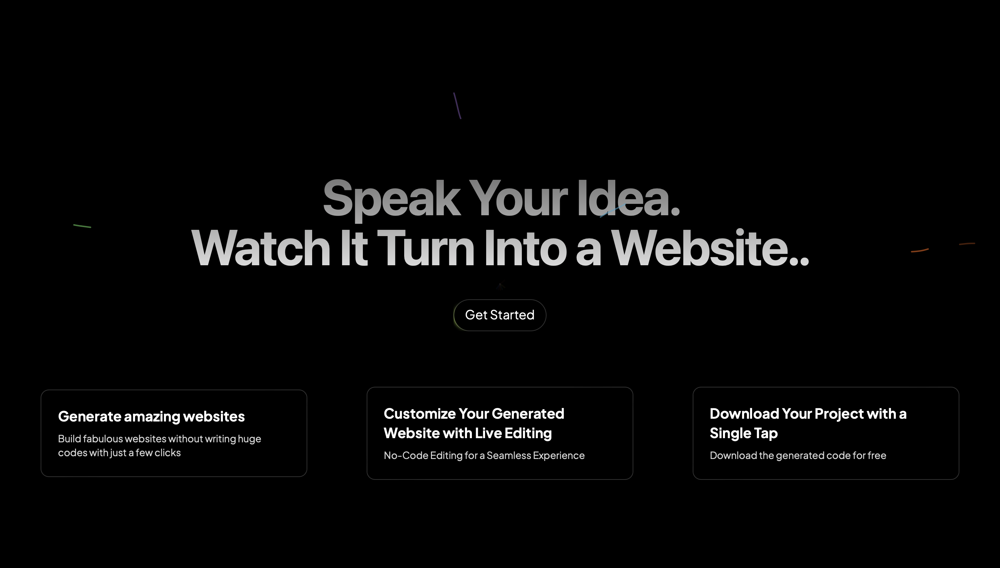
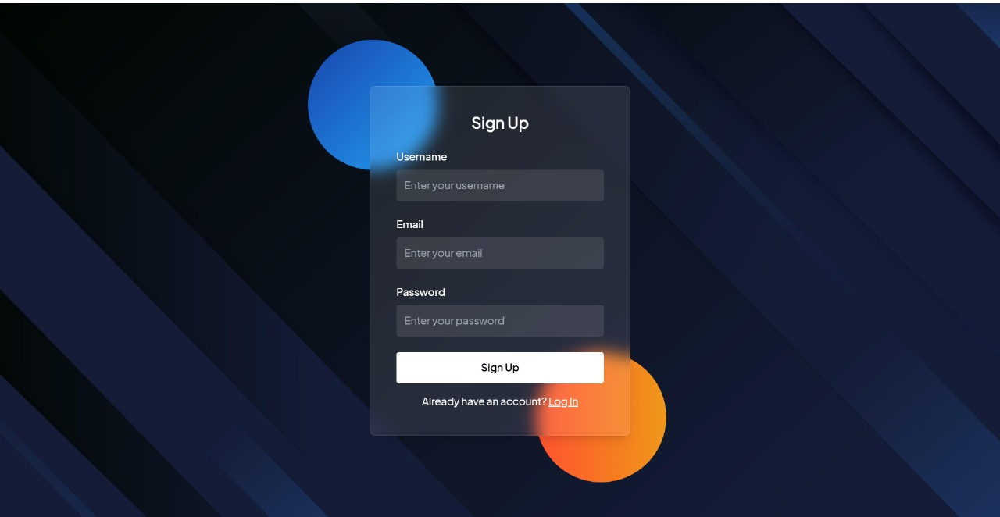
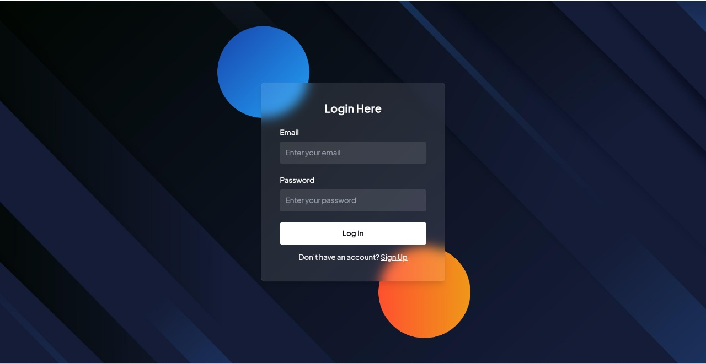
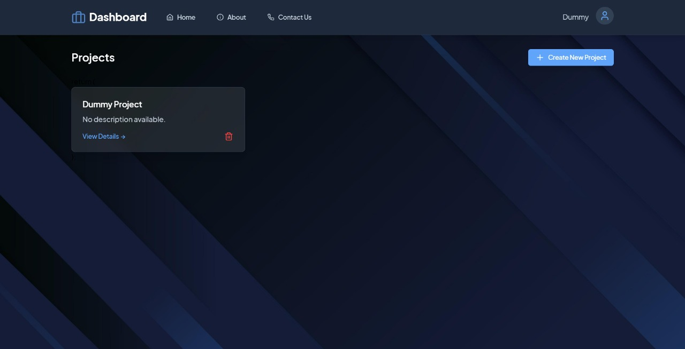
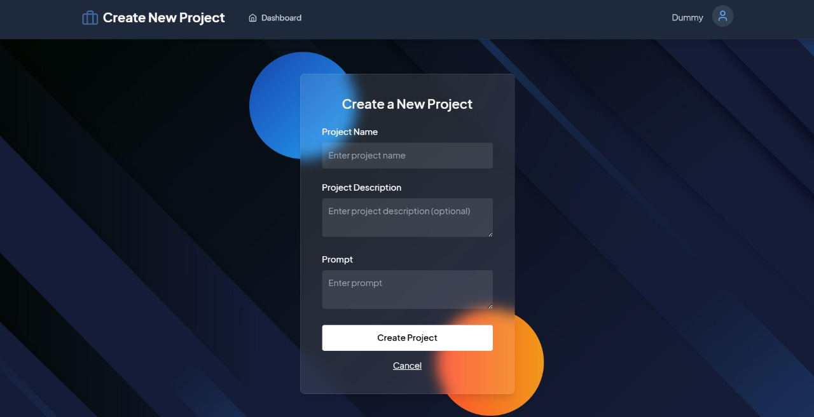
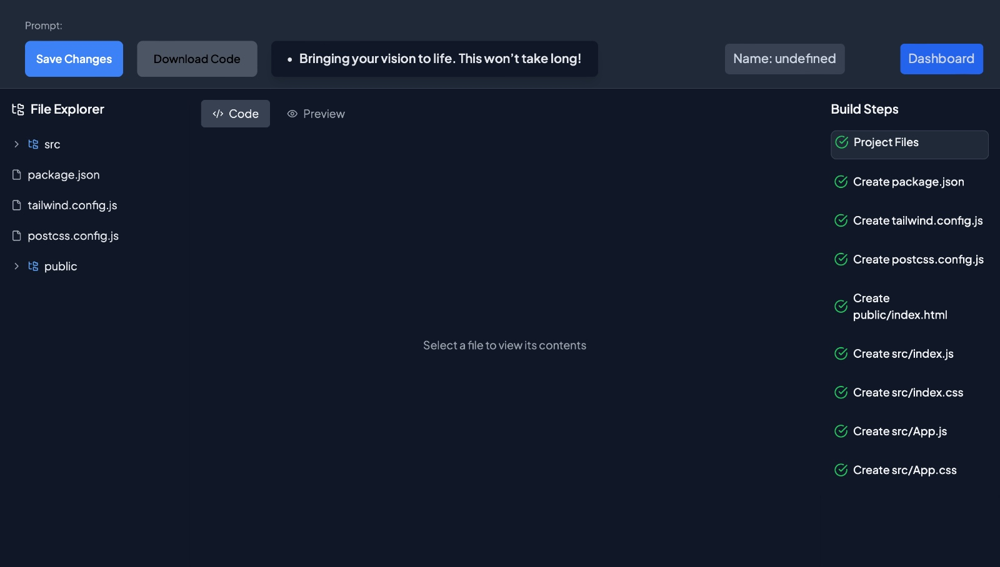

# Prompt-to-Site Builder

The AI-Powered Prompt-to-Site Builder is a sophisticated platform that creates fully functioning web pages from simple natural language descriptions. Designed specifically for individuals with minimal or no programming background, this platform enables anyone to effortlessly construct professional-grade websites. Developed with React, our system guarantees a smooth, user-friendly interface. The resulting websites include modern UI elements, responsive designs, and clean code, ensuring a seamless development process for non-technical users.

## Project Overview
Featuring smart automation and customizable elements, this tool allows anyone to design beautiful websites that fit their unique requirements.
- **Intuitive Interface:** A straightforward design featuring simple customization and layout adjustments.
- **AI-Generated Layouts:** Instant template generation based on your text prompt, adaptable to various niches and aesthetics.
- **Mobile-Responsive Design:** Guarantees that the generated pages look perfect across all devices, including desktops, tablets, and smartphones.
- **Editable Elements:** Comes with built-in, pre-styled components (like navbars, footers, image grids, and forms) that can be tweaked on the fly.
- **Easy Integrations:** Allows embedding of third-party media, social links, and other external tools without hassle.
- **Live Preview:** Instantly visualize your modifications in real-time as you make them.

Our platform harnesses the capabilities of advanced Machine Learning (ML), particularly a Large Language Model (LLM), to help users generate complete web applications from plain text. This integration enables users to simply type out what they need, and the AI converts those descriptions into clean, responsive HTML/React structures.

## What It Does

Our AI Text-to-Website Builder takes your everyday text prompts and turns them into production-ready, polished websites. Tailored for users without a technical background, this software simplifies the entire web development lifecycle. Whether you need a portfolio, a business landing page, or a personal blog, our tool delivers excellent results effortlessly.

## Main Features

1. **Live Editing Capabilities:**
   - Easily modify your newly generated site without touching any code.

2. **One-Click Export:**
   - Instantly download your full project source code at no cost.

3. **Real-Time Previews:**
   - Immediately view a live render of the website you just requested.

4. **User Dashboard & History:**
   - After signing up, all your generated projects are safely stored in our cloud database. You can manage, review, and revisit any previous builds via your dedicated user dashboard.

5. **Direct Code Access:**
   - For advanced users, gain complete control by inspecting and modifying the raw code of individual files right inside the browser.

## Platform Vision

Drawing from extensive user feedback, we focused our ideation phase on meeting the specific demands of developers and students. A strong emphasis on comprehensive project planning and seamless multimedia integration ensures a robust environment for showcasing work. Recognizing the need for better peer networking also drives our development of collaboration-focused features.

Moving forward, these insights will steer the evolution of a highly collaborative environment, offering users a dynamic space to display their creations and interact with a community of peers.

## Upcoming Features

We are planning to roll out the following enhancements to further improve the web generation experience:

1. **Iterative Prompting:**
   - Introducing conversational reprompting so users can continuously tweak and refine the generated layout by chatting with the AI.

2. **Advanced Drag-and-Drop:**
   - Launching a real-time visual editor that allows users to seamlessly drag elements, adjust navigation, and modify typography or color schemes on the fly.

## Application Screenshots

Landing Page


SignUp Page


Login Page


Dashboard Page


Prompt Page


Preview Page



## Technologies Used

- **MongoDB** - Database management
- **Express.js** - Backend web framework
- **React.js** - User interface library
- **Node.js** - Runtime environment  
- **Gemini via Vertex AI** - The core LLM powering the generation
- **Python Pickle** - Used for handling ML model variables
   

## Setup & Installation

To get this project running on your local machine, follow these instructions:

### 1. Backend Setup

Open a terminal, navigate to the `server` folder, and install the required packages:

```bash
cd server
npm install
```

Launch the development server:

```bash
npm run dev
```

### 2. Frontend Setup

In a new terminal window, navigate to the `client` folder and install its dependencies:

```bash
cd client
npm install
```

Start the React development server:

```bash
npm run dev
```

## Running the Application

Once everything is installed:

1. Ensure your backend is running (`npm run dev` in the `server` directory).
2. Ensure your frontend is running (`npm run dev` in the `client` directory).

The backend API will be available at [http://localhost:5001](http://localhost:5001).
The frontend application will be accessible at [http://localhost:5173](http://localhost:5173).
